# Database Schema Documentation

## Overview

This document provides a comprehensive overview of the Patisry database schema, including entity relationships, table structures, and data flow patterns.

## Entity Relationship Diagram (ERD)

```mermaid
erDiagram
    %% Core User Management
    USERS {
        int id PK
        string email UK
        string password_hash
        string first_name
        string last_name
        string phone_number
        date date_of_birth
        datetime date_joined
        datetime last_login
        boolean is_active
        boolean is_staff
        boolean is_superuser
        string location
        string street
        string street_number
        string city
        string region
        string postal_code
        string country
        string address_complement
    }

    %% Authentication & Sessions
    USER_SESSIONS {
        int id PK
        int user_id FK
        string session_token UK
        datetime created_at
        datetime expires_at
        string ip_address
        string user_agent
        boolean is_active
    }

    PASSWORD_RESET_CODES {
        int id PK
        int user_id FK
        string code
        string reset_type
        datetime created_at
        datetime expires_at
        boolean is_used
    }

    %% Baker Management
    BAKERS {
        int id PK
        int user_id FK
        string name
        text description
        int years_experience
        float average_rating
        string profile_image_url
        boolean is_verified
        datetime created_at
        datetime updated_at
    }

    BAKER_SPECIALTIES {
        int id PK
        int baker_id FK
        string specialty_name
        datetime created_at
    }

    BAKER_LANGUAGES {
        int id PK
        int baker_id FK
        string language_code
        string language_name
        datetime created_at
    }

    BAKER_CERTIFICATIONS {
        int id PK
        int baker_id FK
        string certification_name
        string issuing_authority
        date issue_date
        date expiry_date
        string certificate_url
        datetime created_at
    }

    BAKER_WORKING_HOURS {
        int id PK
        int baker_id FK
        string day_of_week
        time opening_time
        time closing_time
        boolean is_closed
        datetime created_at
    }

    %% Product Management
    PRODUCTS {
        int id PK
        int baker_id FK
        string name
        text description
        float base_price
        string location
        string dimensions
        int preparation_time
        boolean is_refrigerated
        date expiration_date
        datetime available_from
        datetime available_to
        float average_rating
        int monthly_sales
        datetime created_at
        datetime updated_at
    }

    PRODUCT_IMAGES {
        int id PK
        int product_id FK
        string url
        string format
        string view_from
        int display_order
        datetime created_at
    }

    PRODUCT_VARIANTS {
        int id PK
        int product_id FK
        string name
        text ingredients
        float price
        datetime created_at
    }

    ALLERGENS {
        int id PK
        string name
        string description
        datetime created_at
    }

    PRODUCT_ALLERGENS {
        int id PK
        int product_id FK
        int allergen_id FK
        datetime created_at
    }

    CATEGORIES {
        int id PK
        string name
        string description
        string icon_url
        datetime created_at
    }

    PRODUCT_CATEGORIES {
        int id PK
        int product_id FK
        int category_id FK
        datetime created_at
    }

    %% Reviews & Ratings
    PRODUCT_REVIEWS {
        int id PK
        int product_id FK
        int client_id FK
        int baker_id FK
        int rating
        string title
        text review_text
        datetime created_at
        datetime updated_at
    }

    BAKER_REVIEWS {
        int id PK
        int baker_id FK
        int client_id FK
        int rating
        string title
        text review_text
        datetime created_at
        datetime updated_at
    }

    %% Orders & Cart Management
    ORDERS {
        int id PK
        int buyer_id FK
        int seller_id FK
        float total_price
        string status
        datetime order_date
        datetime created_at
        datetime updated_at
    }

    ORDER_ITEMS {
        int id PK
        int order_id FK
        int product_id FK
        int quantity
        float unit_price
        float total_price
        text custom_request
        datetime created_at
    }

    CARTS {
        int id PK
        int user_id FK
        datetime created_at
        datetime updated_at
    }

    CART_ITEMS {
        int id PK
        int cart_id FK
        int product_id FK
        int quantity
        datetime selected_date
        time selected_time
        text custom_request
        float total_price
        datetime created_at
        datetime updated_at
    }

    SHIPPING_ADDRESSES {
        int id PK
        int user_id FK
        string street
        string street_number
        string city
        string region
        string postal_code
        string country
        string address_complement
        boolean is_default
        datetime created_at
    }

    %% Favorites Management
    USER_FAVORITES {
        int id PK
        int user_id FK
        int product_id FK
        datetime added_at
    }

    FAVORITE_GROUPS {
        int id PK
        int user_id FK
        string name
        datetime created_at
        datetime updated_at
    }

    FAVORITE_GROUP_ITEMS {
        int id PK
        int group_id FK
        int product_id FK
        datetime added_at
    }

    %% Messaging System
    CONVERSATIONS {
        int id PK
        string title
        datetime created_at
        datetime updated_at
        datetime last_message_time
    }

    CONVERSATION_PARTICIPANTS {
        int id PK
        int conversation_id FK
        int user_id FK
        datetime joined_at
        datetime last_read_at
    }

    MESSAGES {
        int id PK
        int conversation_id FK
        int sender_id FK
        text content
        string message_type
        string status
        datetime created_at
        datetime updated_at
    }

    %% Payment & Promotions
    PAYMENT_METHODS {
        int id PK
        int user_id FK
        string method_type
        string card_last_four
        string card_brand
        date expiry_date
        boolean is_default
        datetime created_at
    }

    PROMOTIONS {
        int id PK
        string name
        text description
        string promotion_type
        float discount_value
        date start_date
        date end_date
        boolean is_active
        datetime created_at
    }

    %% Subscriptions
    SUBSCRIPTION_PLANS {
        int id PK
        string name
        text description
        float price
        string billing_period
        json features
        boolean is_active
        datetime created_at
    }

    USER_SUBSCRIPTIONS {
        int id PK
        int user_id FK
        int plan_id FK
        string status
        datetime start_date
        datetime end_date
        datetime created_at
        datetime updated_at
    }

    %% Analytics & Tracking
    USER_ACTIVITY_LOGS {
        int id PK
        int user_id FK
        string action_type
        string page_url
        json metadata
        datetime created_at
    }

    PRODUCT_VIEWS {
        int id PK
        int product_id FK
        int user_id FK
        datetime viewed_at
        string ip_address
        string user_agent
    }

    BAKER_ANALYTICS {
        int id PK
        int baker_id FK
        date date
        float revenue
        int orders_count
        int products_viewed
        int new_favorites
        datetime created_at
    }

    %% Notifications
    USER_NOTIFICATIONS {
        int id PK
        int user_id FK
        string notification_type
        string title
        text message
        boolean is_read
        datetime created_at
    }

    %% Relationships
    USERS ||--o{ USER_SESSIONS : "has"
    USERS ||--o{ PASSWORD_RESET_CODES : "has"
    USERS ||--o{ BAKERS : "can_be"
    USERS ||--o{ ORDERS : "places"
    USERS ||--o{ CARTS : "has"
    USERS ||--o{ USER_FAVORITES : "has"
    USERS ||--o{ FAVORITE_GROUPS : "creates"
    USERS ||--o{ CONVERSATION_PARTICIPANTS : "participates"
    USERS ||--o{ MESSAGES : "sends"
    USERS ||--o{ PAYMENT_METHODS : "has"
    USERS ||--o{ USER_SUBSCRIPTIONS : "has"
    USERS ||--o{ USER_ACTIVITY_LOGS : "generates"
    USERS ||--o{ PRODUCT_VIEWS : "views"
    USERS ||--o{ USER_NOTIFICATIONS : "receives"

    BAKERS ||--o{ BAKER_SPECIALTIES : "has"
    BAKERS ||--o{ BAKER_LANGUAGES : "speaks"
    BAKERS ||--o{ BAKER_CERTIFICATIONS : "has"
    BAKERS ||--o{ BAKER_WORKING_HOURS : "has"
    BAKERS ||--o{ PRODUCTS : "creates"
    BAKERS ||--o{ BAKER_REVIEWS : "receives"
    BAKERS ||--o{ BAKER_ANALYTICS : "has"

    PRODUCTS ||--o{ PRODUCT_IMAGES : "has"
    PRODUCTS ||--o{ PRODUCT_VARIANTS : "has"
    PRODUCTS ||--o{ PRODUCT_ALLERGENS : "contains"
    PRODUCTS ||--o{ PRODUCT_CATEGORIES : "belongs_to"
    PRODUCTS ||--o{ PRODUCT_REVIEWS : "receives"
    PRODUCTS ||--o{ ORDER_ITEMS : "included_in"
    PRODUCTS ||--o{ CART_ITEMS : "added_to"
    PRODUCTS ||--o{ USER_FAVORITES : "favorited"
    PRODUCTS ||--o{ FAVORITE_GROUP_ITEMS : "in_group"
    PRODUCTS ||--o{ PRODUCT_VIEWS : "viewed"

    ORDERS ||--o{ ORDER_ITEMS : "contains"
    CARTS ||--o{ CART_ITEMS : "contains"
    FAVORITE_GROUPS ||--o{ FAVORITE_GROUP_ITEMS : "contains"
    CONVERSATIONS ||--o{ CONVERSATION_PARTICIPANTS : "has"
    CONVERSATIONS ||--o{ MESSAGES : "contains"
    SUBSCRIPTION_PLANS ||--o{ USER_SUBSCRIPTIONS : "subscribed_to"
```



## Table Categories

### 1. User Management (`01_users_and_auth.sql`)
- **users**: Core user information and authentication
- **user_sessions**: Active user sessions and tracking
- **password_reset_codes**: Password reset functionality
- **user_activity_logs**: User behavior tracking
- **user_notifications**: System notifications

### 2. Baker Management (`02_bakers.sql`)
- **bakers**: Baker profiles and business information
- **baker_specialties**: Baker's culinary specialties
- **baker_languages**: Languages spoken by bakers
- **baker_certifications**: Professional certifications
- **baker_working_hours**: Business hours and availability
- **baker_analytics**: Performance metrics and KPIs

### 3. Product Management (`03_products.sql`)
- **products**: Core product information
- **product_images**: Product photography and media
- **product_variants**: Product variations and options
- **allergens**: Allergen information
- **product_allergens**: Product-allergen relationships
- **categories**: Product categorization
- **product_categories**: Product-category relationships
- **product_reviews**: Customer reviews and ratings
- **product_views**: Product view tracking

### 4. Order Management (`04_orders.sql`)
- **orders**: Order transactions
- **order_items**: Individual items within orders
- **carts**: Shopping cart management
- **cart_items**: Items in shopping carts
- **shipping_addresses**: Delivery addresses
- **order_history**: Order status tracking

### 5. Favorites Management (`05_favorites.sql`)
- **user_favorites**: Individual product favorites
- **favorite_groups**: Organized favorite collections
- **favorite_group_items**: Items within favorite groups

### 6. Messaging System (`06_messages.sql`)
- **conversations**: Chat conversations
- **messages**: Individual messages
- **conversation_participants**: Conversation membership

### 7. Payment & Promotions (`07_payments.sql`)
- **payment_methods**: User payment options
- **promotions**: Discount and promotion campaigns

### 8. Subscriptions (`08_subscriptions.sql`)
- **subscription_plans**: Available subscription tiers
- **user_subscriptions**: User subscription status

### 9. Analytics Views (`09_analytics_views.sql`)
- **monthly_revenue_view**: Revenue analytics
- **product_sales_view**: Sales performance
- **baker_performance_view**: Baker metrics
- **user_engagement_view**: User activity metrics

### 10. Indexes & Constraints (`10_indexes_and_constraints.sql`)
- Performance optimization indexes
- Data integrity constraints
- Foreign key relationships

## Key Design Principles

### 1. Normalization
- **3NF Compliance**: Eliminates redundant data storage
- **Referential Integrity**: Maintains data consistency through foreign keys
- **Atomic Values**: Each field contains a single, indivisible value

### 2. Performance Optimization
- **Strategic Indexing**: Optimized for common query patterns
- **Partitioning**: Large tables partitioned by date for better performance
- **Materialized Views**: Pre-computed analytics for faster reporting

### 3. Scalability
- **Microservice Ready**: Tables designed for service separation
- **Horizontal Scaling**: Partitioning strategy supports growth
- **Caching Friendly**: Structure supports Redis/Memcached integration

### 4. Data Integrity
- **Constraints**: Comprehensive validation rules
- **Audit Trails**: Created/updated timestamps on all tables
- **Soft Deletes**: Logical deletion for data recovery

## Data Flow Patterns

### 1. User Registration Flow
```
User Registration → users → user_sessions → user_activity_logs
```

### 2. Product Discovery Flow
```
Product Search → products → product_images → product_categories → product_views
```

### 3. Order Processing Flow
```
Cart → cart_items → orders → order_items → order_history
```

### 4. Review System Flow
```
Product Purchase → product_reviews → baker_reviews → baker_analytics
```

### 5. Messaging Flow
```
User Interaction → conversations → messages → conversation_participants
```

## Migration Strategy

### Phase 1: Core Tables
1. Users and authentication tables
2. Basic product and baker tables
3. Essential order management

### Phase 2: Enhanced Features
1. Reviews and ratings system
2. Favorites and groups
3. Messaging system

### Phase 3: Analytics & Tracking
1. User activity logging
2. Product view tracking
3. Baker analytics

### Phase 4: Advanced Features
1. Subscription system
2. Payment methods
3. Promotions and discounts

## Security Considerations

### 1. Data Protection
- **Password Hashing**: Bcrypt with salt rounds
- **PII Encryption**: Sensitive data encrypted at rest
- **Access Control**: Role-based permissions

### 2. Audit Trail
- **Activity Logging**: All user actions tracked
- **Data Changes**: Modification history maintained
- **Compliance**: GDPR-ready data handling

### 3. Performance Security
- **Query Optimization**: Prevents SQL injection
- **Rate Limiting**: API endpoint protection
- **Resource Limits**: Prevents resource exhaustion

## Monitoring & Maintenance

### 1. Performance Monitoring
- **Query Performance**: Slow query identification
- **Index Usage**: Index effectiveness tracking
- **Resource Utilization**: Database resource monitoring

### 2. Data Quality
- **Constraint Validation**: Data integrity checks
- **Duplicate Detection**: Data quality monitoring
- **Backup Verification**: Data recovery testing

### 3. Growth Planning
- **Capacity Planning**: Growth projection analysis
- **Partitioning Strategy**: Table size management
- **Archive Policies**: Historical data management

This schema provides a solid foundation for the Patisry platform, supporting current functionality while enabling future growth and feature expansion.