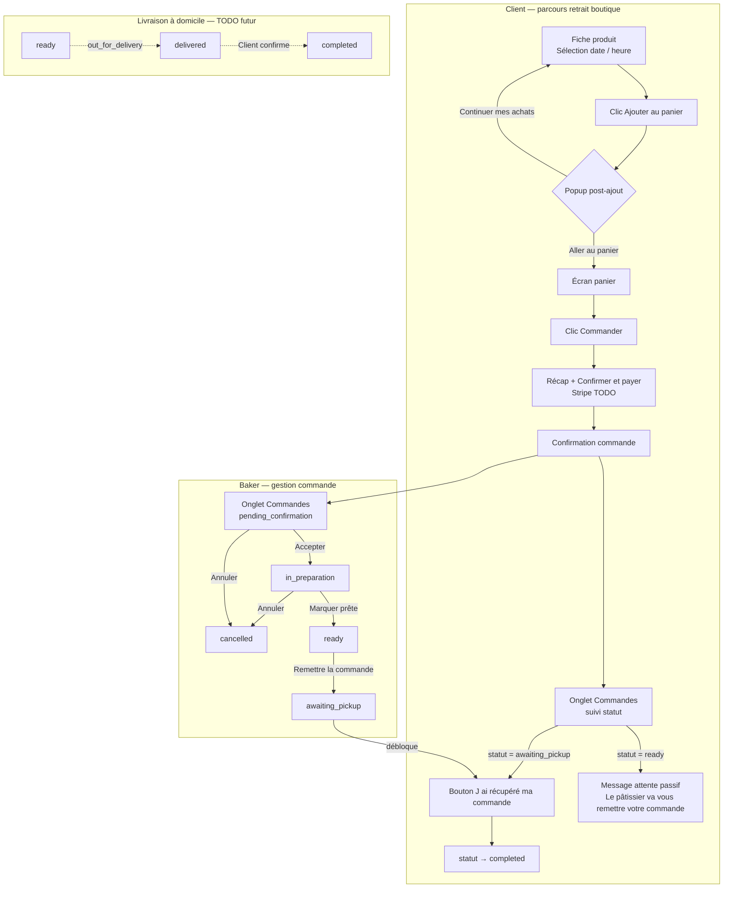
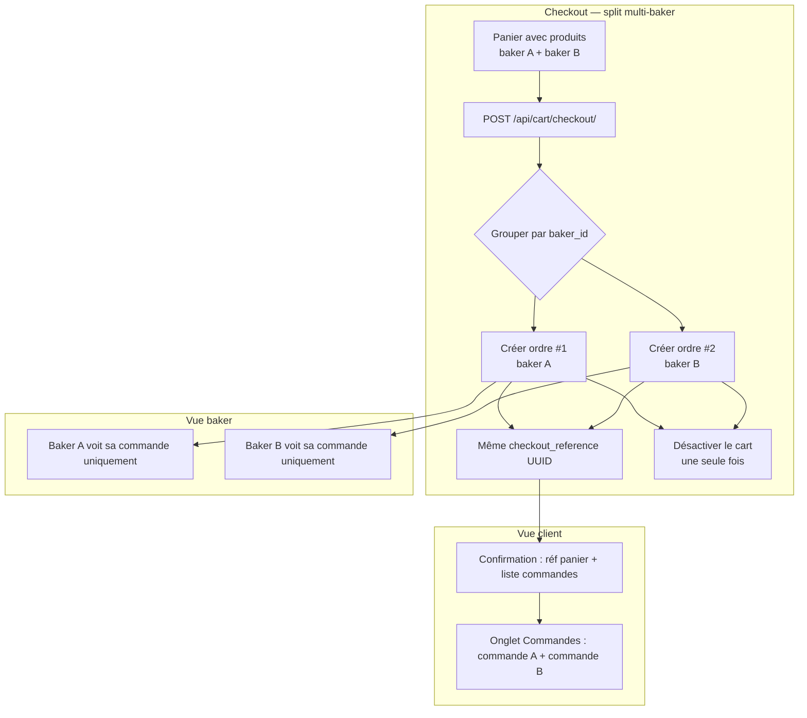

# Vue Produit — Fonctionnalités, maturité et phasage (Patisry)

Document de travail **Product Owner** : inventaire fonctionnel transversal (API + application Flutter **consommateur et parcours pâtissier** dans la même app), statut d’implémentation indicatif, et cadre **MVP → V1**.  
Les références d’API détaillées restent dans les fichiers `00_` à `15_`. **Dernière passe de réconciliation code** : mars 2026 (branches locales telles qu’ouvertes dans l’environnement de développement).

---

## 1. Résumé exécutif

Patisry est une plateforme **marketplace de pâtisseries** : catalogue et recherche, commande et paiement, favoris et groupes, messagerie, avis, abonnements, analytics, et parcours **baker** (profil, produits). Les **microservices Django** exposent des APIs REST distinctes ; l’app Flutter agrège ces services via `AppConfig` ([`Patisry/lib/core/config/app_config.dart`](../../Patisry/lib/core/config/app_config.dart)).

**Forces observées** : couverture API large, app avec écrans pour la majorité des domaines métier, configuration **local / Freebox** centralisée.

**Points d’attention PO / technique** :

- **User Service** : `GET /api/users/` est documenté comme liste « admin » dans l’historique métier, mais le code n’applique que `IsAuthenticated` — **liste de tous les utilisateurs possible pour tout compte connecté** (voir [`02_User_Service.md`](02_User_Service.md) et code `user-service`).
- **Guide commun** : rate limits, format d’erreur unifié, durées JWT sont des **cibles** ; la réalité peut varier par service (voir note dans [`00_Guide_Commun.md`](00_Guide_Commun.md)).
- **Admin Service** : API dédiée ; **pas d’écran admin dans l’app mobile** (usage attendu : outil interne / autre client).
- **Notification Service** : API riche ; **pas de client API dédié** repéré dans `lib/features/*/data/datasources/` — intégration app à confirmer (push / in-app).
- **Analytics** : API et `analytics_api.dart` côté dashboard ; couverture « tous les écrans » à valider.

---

## 2. Parcours utilisateur — commande de bout en bout

### 2.1 Parcours client (étapes 1–5)

1. **Ajout au panier** — Sur la fiche produit, le client choisit une date et un créneau horaire, puis clique sur **"Ajouter au panier"** (la sélection de l'heure ne déclenche plus d'ajout automatique). Après l'ajout réussi, une **popup** propose deux actions : **"Aller au panier"** ou **"Continuer mes achats"**.
2. **Validation du panier** — Depuis l'écran panier, le client clique sur **"Commander"**.
3. **Confirmation et paiement** — L'écran de commande affiche le récapitulatif (produit, date/heure/ville de réception, moyen de paiement). Le moyen de paiement par défaut est **"Carte bancaire"** tant que Stripe n'est pas implémenté.  
   > **Stripe non implémenté** — Le bouton "Confirmer et payer" appelle directement `POST /api/cart/checkout/` puis navigue vers l'écran de confirmation sans passer par Stripe.
4. **Confirmation de commande** — L'écran de confirmation est affiché.
5. **Suivi** — La commande est visible dans **l'onglet "Commandes"** du compte client, avec le statut mis à jour par le pâtissier.

### 2.2 Parcours pâtissier (étapes 5–6)

5. **Réception de la commande** — Dès que le client valide, la commande apparaît dans l'onglet **"Commandes"** des paramètres pâtissier, à l'état **"En attente de confirmation"**.  
   > **TODO push** : connecter push notification / WebSocket pour actualiser automatiquement l'onglet. En attendant, un pull-to-refresh ou rechargement manuel suffit.
6. **Gestion des états** — La commande est cliquable ; le pâtissier fait avancer le statut dans cet ordre :

| Statut API | Libellé FR | Acteur | Impl. | Notes |
|---|---|---|---|---|
| `pending_confirmation` | En attente de confirmation | _(état initial — checkout)_ | ✅ | |
| `in_preparation` | En préparation | Baker | ✅ | |
| `ready` | Prête | Baker | ✅ | La commande est prête à être récupérée |
| `awaiting_pickup` | En attente de récupération | Baker | ✅ | Baker valide la remise physique → débloque la confirmation client |
| `completed` | Terminée | **Client uniquement** | ✅ | Seulement depuis `awaiting_pickup` |
| `cancelled` | Annulée | Baker **ou** Client | ✅ | Seulement depuis `pending_confirmation` ou `in_preparation` |
| `out_for_delivery` | En cours de livraison | Baker | ⚙️ TODO | Réservé au futur parcours **livraison à domicile** — non utilisé pour le retrait boutique |
| `delivered` | Livrée | Baker | ⚙️ TODO | Réservé au futur parcours livraison |

> **Règle clé (parcours retrait boutique)** : la séquence est **strictement linéaire** — un seul statut par étape. Le pâtissier doit obligatoirement passer par `awaiting_pickup` (remise physique confirmée) **avant** que le client puisse confirmer la réception (`completed`). Si le statut est `ready`, le client voit un message d'attente passif mais ne peut pas encore confirmer. Les statuts `out_for_delivery` et `delivered` sont réservés au futur parcours livraison à domicile.

### 2.3 Diagramme de flux complet



### 2.4 Workflow commande détaillé — table des transitions

| De (statut actuel) | Vers | Acteur autorisé | Précondition backend | Impl. |
|---|---|---|---|---|
| _(aucun)_ | `pending_confirmation` | Système (checkout) | Panier non vide + `baker_id` présent sur chaque produit | ✅ |
| `pending_confirmation` | `in_preparation` | Baker | JWT baker == baker de la commande | ✅ |
| `pending_confirmation` | `cancelled` | Baker ou Client | Idem | ✅ |
| `in_preparation` | `ready` | Baker | Idem | ✅ |
| `in_preparation` | `cancelled` | Baker ou Client | Idem | ✅ |
| `ready` | `awaiting_pickup` | Baker | Idem — valide la remise physique | ✅ |
| `awaiting_pickup` | `completed` | Client | JWT user == acheteur de la commande | ✅ |
| `ready` | `out_for_delivery` | Baker | _(futur livraison)_ | ⚙️ TODO |
| `out_for_delivery` | `delivered` | Baker | _(futur livraison)_ | ⚙️ TODO |
| `delivered` | `completed` | Client | _(futur livraison)_ | ⚙️ TODO |

**TODOs identifiés :**

- **Push / WebSocket** : notifier le baker en temps réel lors d'une nouvelle commande.
- **Push client** : notifier le client lors du passage à `awaiting_pickup`.
- **Livraison à domicile** : implémenter `out_for_delivery` → `delivered` → `completed` (parcours distinct du retrait boutique).
- **Suppression restreinte admin** : le bouton de suppression temporaire (debug) doit devenir admin-only en production ([`lib/features/orders/presentation/order_detail_screen.dart`](../../Patisry/lib/features/orders/presentation/order_detail_screen.dart) — voir TODO dans le code).

### 2.5 Checkout multi-baker — split de panier (marketplace)

#### Principe

Un panier peut contenir des produits de **plusieurs pâtissiers différents**. Au checkout, **une commande distincte est créée par baker**, toutes liées par un identifiant commun `checkout_reference` (UUID). C'est le pattern standard des marketplaces (Amazon, Etsy).

#### Comportement ✅ Implémenté

| Comportement | Détail |
|---|---|
| **Un panier, N commandes** | Autant d'ordres créés que de bakers distincts dans le panier |
| **checkout_reference commun** | Toutes les commandes du même checkout partagent le même UUID |
| **Workflow indépendant par baker** | Chaque commande a son propre cycle `pending_confirmation` → … → `completed` |
| **Frais proportionnels** | `delivery_fee`, `service_fee`, `discount_amount` répartis proportionnellement au sous-total de chaque group baker |
| **Produit sans baker_id = refus** | 400 BAD REQUEST si un produit n'a pas de `baker_id` dans le catalogue |

#### Contrat API (POST `/api/cart/checkout/`) ✅

```json
{
  "checkout_reference": "72978aed-…-…",
  "orders": [
    { "order_id": 70, "order_number": "ORD-20260405-000070", "baker_id": 95, "total_price": "12.00", "status": "pending_confirmation" },
    { "order_id": 71, "order_number": "ORD-20260405-000071", "baker_id": 100, "total_price": "8.00", "status": "pending_confirmation" }
  ],
  "total_price": "20.00",
  "status": "pending_confirmation"
}
```

#### Vue client (Flutter) ✅

- **Écran de confirmation** : si 1 seul baker → affiche le numéro de commande classique. Si plusieurs bakers → affiche la **référence panier** (8 premiers caractères de `checkout_reference`) et la liste des sous-commandes par baker avec leur montant partiel.
- **Liste des commandes** : chaque commande apparaît individuellement. Groupement visuel par `checkout_reference` = **TODO V1** optionnel.

#### Schéma DB ✅

```sql
ALTER TABLE orders ADD COLUMN IF NOT EXISTS checkout_reference UUID NULL;
CREATE INDEX IF NOT EXISTS idx_orders_checkout_reference ON orders(checkout_reference);
```

#### Diagramme flux multi-baker



---

## 3. Inventaire fonctionnel — API vs application

Légende : **Oui** = présent côté service + client ou écran dédié raisonnable ; **Partiel** = une des deux faces incomplète ou fragile ; **Non** = non branché ou absent.

| Domaine | Fonctionnalité (vue PO) | Backend (doc) | App Flutter | Notes |
|--------|---------------------------|---------------|-------------|--------|
| Auth | Inscription, login, refresh JWT | Oui — [`01_Auth_Service.md`](01_Auth_Service.md) | Oui — `auth_api`, écrans auth | Mot de passe oublié : API documentée ; vérifier couverture UI. |
| Utilisateur | Profil `/me/`, mise à jour compte | Oui — [`02_User_Service.md`](02_User_Service.md) + actions `personal_info`, `address` | Partiel — `user_api`, `profile_screen` | Durcir liste `GET /users/` si exigence « admin only ». |
| Affichage | Home payload, fiche produit enrichie | Oui — [`03_Display_Service.md`](03_Display_Service.md) | Oui — `display_api`, `home_screen`, `product_screen` | Utilise `GET .../display/products/home/payload/` et `.../full/`. |
| Produits (CRUD riche) | Variantes, images, catégories, etc. | Oui — [`04_Product_Service.md`](04_Product_Service.md) | Partiel — `product_api`, écrans pâtissier | Baker / édition : voir `pastry`, `product_api`. |
| Commandes & panier | Panier, checkout multi-baker, commandes, machine d'états baker/client, popup post-ajout | Oui — [`07_Order_Service.md`](07_Order_Service.md) | Oui — `order_api`, `cart_screen`, `orders_screen`, `order_detail_screen` | **Checkout marketplace** : panier multi-baker → N commandes distinctes liées par `checkout_reference` UUID. Workflow retrait boutique : `pending_confirmation` → `in_preparation` → `ready` → `awaiting_pickup` (baker remet) → `completed` (client confirme) ; annulation depuis `pending_confirmation` / `in_preparation`. `GET /orders/?scope=received` pour le pâtissier. Popup post-ajout : "Aller au panier" / "Continuer mes achats". TODO push notification nouvelles commandes / passage à `awaiting_pickup`. TODO livraison : `out_for_delivery` → `delivered` → `completed`. TODO V1 : groupement visuel par `checkout_reference`. |
| Paiement | Moyens de paiement, intents Stripe, promos | Oui — [`12_Payment_Service.md`](12_Payment_Service.md) | Partiel — `payment_api`, multiples écrans paiement | Apple/Google/PayPal : vérifier maturité vs sandbox prod. |
| Favoris | Favoris, groupes, items | Oui — [`09_Favorite_Service.md`](09_Favorite_Service.md) | Oui — `favorite_api`, `favorites_screen`, `favorite_group_detail_screen` | Doc enrichie : `DELETE by-product`, retrait d’item groupe. |
| Baker | Profil, spécialités, dispo, par user_id | Oui — [`10_Baker_Service.md`](10_Baker_Service.md) | Oui — `baker_api`, `baker_profile`, dashboard | Chemin `userid/{user_id}/` aligné code. |
| Recherche | Produits, boulangers, suggestions, trending | Oui — [`11_Search_Service.md`](11_Search_Service.md) | Oui — `search_api` | Préfixe `api/search/`. |
| Messages | Conversations, messages, lu | Non — [`05_Message_Service.md`](05_Message_Service.md) | Partiel — `message_api`, `messages_screen`, `conversation_screen` | |
| Notifications | Liste, lu, envoi (admin) | Non — [`06_Notification_Service.md`](06_Notification_Service.md) | Non (client dédié non listé) | À prioriser si besoin push / centre de notifs. |
| Avis | Avis produit, résumés | Partiel — [`15_Review_Service.md`](15_Review_Service.md) | Partiel — `review_api`, `reviews_screen` | |
| Abonnements & newsletter | Plans, souscription, facturation | Non — [`13_Subscription_Service.md`](13_Subscription_Service.md) | Partiel — `subscription_screen` | Doc : `PUT .../unsubscribe/` ajouté (complément `cancel/`). |
| Analytics | Sessions, page views, recherche, agrégats | Partiel — [`08_Analytics_Service.md`](08_Analytics_Service.md) | Partiel — `analytics_api`, `dashboard_screen` | Mesure fines par parcours à valider. |
| Admin | Utilisateurs, boulangers, produits, commandes, KPIs | Partiel — [`14_Admin_Service.md`](14_Admin_Service.md) | Non | Hors scope app mobile actuelle. |

### 3.1 Modules Flutter (écrans / features)

Répertoire principal : `Patisry/lib/features/` — écrans notables : `home`, `product`, `cart`, `payment` (+ sous-écrans cartes), `orders` (+ détail), `favorites` (+ détail groupe), `auth` (login, register, compte connecté), `profile`, `baker`, `pastry` (mes pâtisseries, édition), `dashboard`, `messages`, `reviews`, `subscription`, `search`, `connected`, `favorite` (legacy possible), etc.

Clients HTTP typiques : fichiers `*_api.dart` listés dans le plan de réconciliation (auth, user, display, product, order, payment, favorite, baker, search, message, review, subscription, analytics).

---

## 4. Transversal produit

| Sujet | Commentaire PO |
|--------|----------------|
| Auth JWT | Refresh géré dans `AuthApi` ; durée de vie — voir `auth-service` / `SIMPLE_JWT`, pas seulement le guide commun. |
| Géolocalisation | Display home supporte `lat`/`lon` ; parcours « nearby » documenté en [`03_Display_Service.md`](03_Display_Service.md). |
| Stripe | Webhook + intents documentés [`12_Payment_Service.md`](12_Payment_Service.md) ; critère « prod ready » à votre arbitrage. |
| Sécurité / conformité | RGPD, consentements, logs : non détaillés dans cette vue ; à traiter en V1 si requis. |
| Environnements | Ports locaux vs Freebox : [`00_Guide_Commun.md`](00_Guide_Commun.md) + `app_config.dart`. |

---

## 5. Phasage — MVP, bêtas, V1

Les tableaux ci-dessous sont une **première proposition** basée sur l’état du code et des docs. La section suivante est **à remplacer** par vos critères business.

### 5.1 MVP (proposition initiale)

| Id | Livrable | Justification courte |
|----|-----------|----------------------|
| M1 | Compte : register, login, profil minimal | Sans cela pas de cohorte test. |
| M2 | Catalogue : home + détail produit (display) | Cœur de la découverte. |
| M3 | Panier + commande + liste commandes | Preuve de valeur transactionnelle. |
| M4 | Paiement : au moins un flux Stripe test bout-en-bout | Sinon commande « fictive ». |
| M5 | Baker : profil + liste / édition produits basique | Vous avez inclus le parcours baker dans le scope. |

### 5.2 Bêta fermée (proposition initiale)

| Id | Livrable |
|----|-----------|
| B1 | Favoris + groupes utilisables sans erreurs bloquantes |
| B2 | Messagerie client ↔ baker (flux principal) |
| B3 | Avis consultables + création sur produit commandé (règle métier à définir) |
| B4 | Recherche + suggestions / trending exploités dans l’UI |
| B5 | Durcissement sécurité user list + rôles admin |

### 5.3 Bêta ouverte (proposition initiale)

| Id | Livrable |
|----|-----------|
| O1 | Notifications in-app (consommation API) ou push équivalent |
| O2 | Analytics de parcours sur les écrans clés |
| O3 | Abonnements / newsletter avec parcours clair (upgrade / cancel) |
| O4 | Promotions / codes validés côté UX |
| O5 | Monitoring, taux d’erreur, support utilisateur |

### 5.4 V1 (proposition initiale)

| Id | Livrable |
|----|-----------|
| V1 | Paiement production + politique remboursement |
| V2 | Modération avis / signalement |
| V3 | Outil admin (web ou app séparée) ou intégration ops |
| V4 | SLA, conformité (CGU, données personnelles, facturation) |
| V5 | Performance & SEO / ASO si applicable |

---

## 6. Critères à valider par le PO (obligatoire)

_Remplir cette section pour figer les jalons._

1. **MVP considéré comme « terminé » lorsque** :  
   - …

2. **Bêta fermée : conditions d’invitation / taille de cohorte / durée** :  
   - …

3. **Bêta ouverte : critères de stabilité (crash rate, paiement, support)** :  
   - …

4. **V1 : périmètre légal, pays, devises, livraison** :  
   - …

5. **Hors scope explicite** :  
   - …

---

## 7. Annexe — Réconciliation documentation / code

| Service | Fichier doc | Ajustements récents (résumé) |
|---------|-------------|------------------------------|
| Commun | `00_Guide_Commun.md` | Note « cible vs implémentation ». |
| User | `02_User_Service.md` | Réalité `GET /users/` ; endpoints PATCH profil/adresse/statut. |
| Display | `03_Display_Service.md` | `home/payload`, `full` ; préfixe `display/products`. |
| Product | `04_Product_Service.md` | Exemple URL pagination corrigé (port 8006). |
| Favoris | `09_Favorite_Service.md` | DELETE by-product ; DELETE item de groupe. |
| Baker | `10_Baker_Service.md` | Paramètre `user_id` dans l’URL userid. |
| Subscription | `13_Subscription_Service.md` | `PUT .../unsubscribe/`. |

**Prochaine vérification recommandée** : après chaque release majeure, rejouer un diff `urls.py` / ViewSets vs `0X_*.md` et mettre à jour la date en tête de la section 1.

---

*Fin du document 16.*
