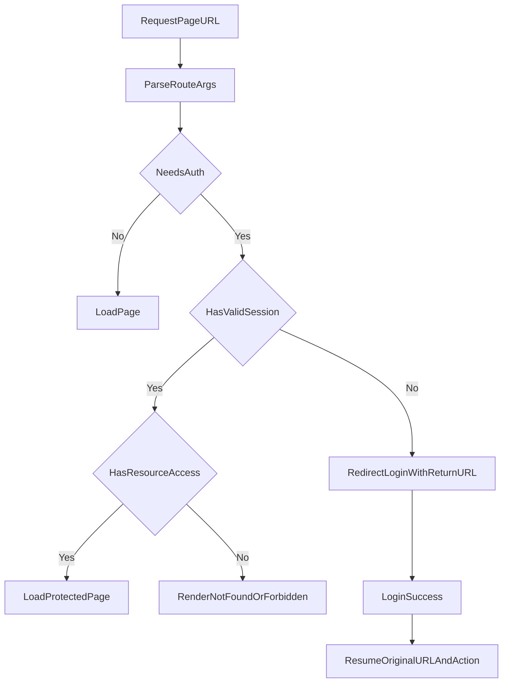

# MVP Stabilization Schema (Product -> Payment -> Account)

## Objectif

Ce document formalise les changements MVP demandés pour:
- robustesse produit/panier/paiement,
- visibilité et protection des routes web partageables,
- exposition d'un endpoint baker public minimal,
- reprise de session login sur action interrompue.

## Navigation et protection d'acces

## API modifiees

### baker-service

- **Nouveau endpoint public minimal**
  - `GET /api/bakers/{id}/public/`
  - auth: `AllowAny`
  - payload MVP:
    - `id`
    - `business_name`
    - `profile_image_url`
    - `pickup_city`
    - `is_verified`
    - `is_active`
    - `accepts_orders`

- **Endpoint protege conserve**
  - `GET /api/bakers/{id}/`
  - auth: JWT (inchangé)

### auth-service / user-service (JWT parity)

- Alignement de lecture de cle JWT:
  - priorite `JWT_SECRET_KEY`
  - fallback `SECRET_KEY`
- But: eviter les `401 Token invalide` inter-services.

## Frontend (routes partageables MVP)

Routes URL supportees en plus des routes nommees:
- `/product/{id}`
- `/baker/{id}`
- `/account/orders/detail?orderId={id}`

Comportements:
- page protegee + non connecte -> redirection login avec `returnRoute`,
- parametres invalides -> page introuvable,
- detail commande protege par session.

## Integration tests a mettre a jour

- baker-service:
  - ajouter test `GET /api/bakers/{id}/public/` en guest => `200`,
  - verifier forme minimale de payload.
- auth/user integration:
  - verifier qu'un token emis par auth-service est accepte par user-service.
- frontend smoke (manual QA MVP):
  - add to cart en guest -> login -> retour et reprise action,
  - popup panier: boutons centres + espacement 5px,
  - icone panier toolbar ne replique pas la route si deja sur `/cart`.
